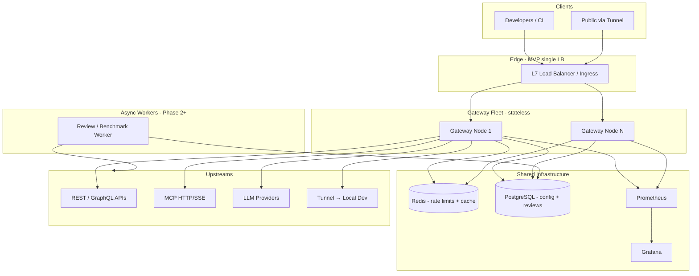

# ReviewerAI — System Architecture

**Version:** 0.1  
**Companion doc:** [PROJECT_REQUIREMENTS.md](./PROJECT_REQUIREMENTS.md)  
**Status:** Draft — pending approval before scaffolding

---

## 1. Architectural Goals

1. **Single logical request path** for all proxied traffic: authenticate → rate limit → select upstream (LB) → proxy → emit metrics/traces.
2. **Stateless gateway nodes**; all cross-request state in Redis, PostgreSQL, or the metrics pipeline.
3. **Moderate-load MVP** validated with load tests; **enterprise-scale** achieved by horizontal duplication and component substitution—not rewrites.
4. **Clear separation** between control plane (CRUD, reviews, config) and data plane (proxy).

---

## 2. High-Level Diagram



---

## 3. Recommended Tech Stack

| Layer | Choice | Justification | Trade-offs |
|-------|--------|---------------|------------|
| **Gateway / proxy / LB logic** | **Go 1.22+** (`net/http`, `httputil.ReverseProxy`, custom LB pool) | Strong concurrency, small memory footprint, mature TLS and HTTP/2; fits 500–100k+ RPS per node with tuning | Slower feature velocity than Node for some teams; less ecosystem than Envoy for advanced L7 policies |
| **Optional later: dedicated proxy** | **Envoy** as sidecar or replacement data plane | Policy at scale, WASM filters | Heavier ops; MVP avoids two config models |
| **Rate limiting** | **Redis 7** (token bucket + sliding window via Lua/scripts or Redis Cell–style patterns) | Sub-ms at moderate load; cluster mode for enterprise | Redis is SPoF unless clustered; network hop per request |
| **Control plane API** | **Go** (same binary or `cmd/control` subcommand) | Shared types, one deploy artifact | Could split microservice later |
| **Config + reviews storage** | **PostgreSQL 16** | ACID, JSONB for flexible test defs, familiar ops | Write throughput becomes bottleneck at extreme review job volume—shard/async |
| **Metrics (MVP)** | **Prometheus** scrape + **Grafana** dashboards | Fast local dev, standard PromQL | Long-term high-cardinality expensive—migrate tail to Mimir/VictoriaMetrics |
| **Metrics (Phase 2+ history)** | **Prometheus remote write → Mimir** or **ClickHouse** | Handles enterprise sample rates | Extra operational cost |
| **Logs** | **stdout JSON** → Loki or cloud log drain (MVP: docker logs) | Simple | Full-text search needs Loki/ELK at scale |
| **Tracing** | **OpenTelemetry** → Jaeger/Tempo (optional in MVP) | Request path across gateway and worker | Sampling required at high RPS |
| **Dashboard** | **Next.js 14 + React + TanStack Query** | SSR for auth pages, rich charts (e.g. uPlot/Recharts) | Heavier than SPA; acceptable for internal tool |
| **Monorepo** | **pnpm workspaces** + Go modules at repo root | Shared TS types package; single clone | Polyglot CI |
| **Local dev** | **Docker Compose** | Redis, Postgres, Prometheus, Grafana, gateway, dashboard | Not production HA |
| **Load test** | **k6** | Scriptable 429 and burst scenarios | — |
| **Tunnel (MVP)** | **WebSocket** from agent to gateway, multiplexed HTTP | One outbound conn; no separate tunnel binary service initially | Scale limits → dedicated **tunnel relay** service in Phase 2 |

### Why not Node/Rust-only for gateway?

- **Node:** Excellent for dashboard; event-loop limits and memory under 50k+ concurrent connections favor Go/Rust at enterprise tier.
- **Rust:** Best raw performance; MVP time-to-value favors Go unless team is Rust-primary.

---

## 4. Component Design

### 4.1 API gateway layer (data plane)

**Responsibilities:**

- Terminate TLS (or receive TLS from upstream ingress).
- Validate **API key** or tunnel token; attach tenant/context to request context.
- Enforce **rate limits** (Redis): dimensions `api_key`, `client_ip`, `target_id`, optional `tunnel_id`.
- **Load balance** across healthy upstreams for the resolved target.
- **Reverse proxy** with timeouts (connect, header, full body/stream), max body size, WebSocket/SSE pass-through for MCP/LLM streams.
- Emit **metrics** (latency histogram, status class, limit outcomes) and **structured logs** with `trace_id`, `target_id`, `upstream`.

**Statelessness:**

- Target definitions and LB pools loaded from PostgreSQL with **in-memory cache** (TTL 5–30s) + **Redis pub/sub** (or PostgreSQL NOTIFY) for invalidation on config change.
- No sticky session state on gateway in MVP.

**Package layout (planned monorepo):**

- `services/gateway/` — main binary
- `packages/go/shared/` — types, config DTOs
- `internal/ratelimit`, `internal/lb`, `internal/proxy`, `internal/auth`

### 4.2 Load balancer module

**In-process** on each gateway node (not separate hop in MVP):

- **Pool** per `target_id`: list of `{url, weight, active_conns, health}`.
- **Health checker** goroutine per pool: interval default 10s, failure threshold 3 → **unhealthy**; success threshold 2 → **healthy**.
- **Strategies:** round-robin, least-connections (atomic counters), weighted RR.
- **Selection** happens after rate limit to avoid counting rejected requests against upstream load incorrectly (optional: count only forwarded requests).

**Enterprise evolution:** For very large pools or global traffic steering, move to **DNS + anycast** or **Envoy xDS**; gateway remains compatible by consuming xDS snapshot instead of DB pool (adapter interface).

### 4.3 Rate limiter (Redis-backed)

**Model:**

- Rules stored in PostgreSQL; compiled to Redis keys: `rl:{scope}:{id}:{window}`.
- **Token bucket:** `rate`, `burst`, refill interval.
- **Sliding window:** sorted set or Redis sliding window script for stricter fairness.

**Multi-gateway consistency:** All nodes hit same Redis; **no local-only limits** except optional short-lived “local burst shield” (disabled in MVP to keep semantics simple).

**429 response:** JSON body `{ "error": "rate_limit_exceeded", "retry_after_sec": N }`, headers `Retry-After`, `X-RateLimit-Limit`, `X-RateLimit-Remaining`.

**Failure mode:** If Redis unavailable, **fail closed** (503) for data plane (configurable fail-open only in dev via env flag).

### 4.4 Secure tunnel

**MVP:**

- Developer runs `reviewerai tunnel` (CLI subcommand of gateway or thin client) → **WebSocket** to `wss://<host>/tunnel/connect?token=...`.
- Gateway maps `Host: <subdomain>.reviewerai.local` → tunnel session → forward HTTP to agent → agent forwards to `localhost:PORT`.
- **TLS** at ingress; token rotation via control API.
- **IP allowlist** checked at gateway after TLS (X-Forwarded-For aware with trusted proxy config).

**Phase 2:** Dedicated **tunnel relay** pods (still outbound-only from agent); gateway routes to relay via internal gRPC. Enables **100k+ concurrent tunnels** without tying to proxy worker count.

### 4.5 Control plane

- REST API: `/api/v1/targets`, `/upstreams`, `/rate-limits`, `/reviews`, `/tunnels`, `/metrics/query` (proxy to Grafana/PromQL).
- Dashboard Next.js app calls control API; WebSocket or SSE for **live metrics** (MVP: poll Prometheus/Grafana proxy every 1–5s; Phase 2: Grafana Live or custom WS from aggregator).

### 4.6 Review and benchmark worker

**MVP:** Synchronous **light** benchmarks via API; heavier jobs run in **background goroutine pool** inside gateway or separate `services/worker` container (same repo).

- Pulls test definitions from PostgreSQL.
- Executes HTTP/MCP/LLM calls **outside** the hot proxy path (uses same client libs, different circuit limits).
- Writes **review_runs** and **review_scores** to PostgreSQL; pushes summary gauges to Prometheus.

**Enterprise:** Horizontal **worker queue** (NATS/SQS + autoscaled workers); PostgreSQL holds job state; results bulk-insert to ClickHouse for analytics.

### 4.7 Metrics pipeline

**MVP:**

- Gateway exposes `/metrics` (Prometheus format): `reviewerai_http_requests_total`, `reviewerai_http_request_duration_seconds`, `reviewerai_rate_limit_rejections_total`, `reviewerai_upstream_health`, `reviewerai_active_connections`, `reviewerai_tunnel_connected`.
- Prometheus scrapes each gateway instance every 15s.
- Grafana dashboards provisioned from `infra/grafana/dashboards/`.

**Cardinality control:** Low-cardinality labels on histograms (`target_id` OK at 200 targets; avoid unbounded `path` labels—use route template or `target_id` only).

**Enterprise path:**

| Component | MVP | Enterprise scale change |
|-----------|-----|-------------------------|
| Scraping | Single Prometheus | **Prometheus agent** per AZ → **remote write** to **Mimir/Cortex** |
| Long-term queries | Prom 15d retention | **ClickHouse** or **Mimir** for 1y+ |
| Dashboards | Grafana single instance | Grafana HA + read replicas |
| Real-time RPS | Scrape interval 15s | **Recording rules** + **streaming aggregator** (Flink/Custom) if sub-second SLA |

### 4.8 Storage summary

| Data | Store | Retention MVP |
|------|-------|----------------|
| Targets, upstreams, limits, users, API keys | PostgreSQL | Indefinite |
| Review runs, scores, test defs | PostgreSQL | 90 days (configurable) |
| Rate limit counters | Redis | TTL per window |
| Time-series metrics | Prometheus | 15 days |
| Audit logs (optional) | PostgreSQL or Loki | 30 days |

---

## 5. Request Path (Data Plane)

```
Client Request
  → Ingress TLS
  → Gateway: extract API key / tunnel token
  → Auth middleware (constant-time compare, cache key metadata)
  → Resolve target (host/path prefix or explicit route table)
  → Rate limit check (Redis pipeline, 1 round-trip)
  → LB: pick healthy upstream
  → Proxy: forward request (inject tracing headers)
  → Record latency, status, bytes
  → Response to client
```

**Streaming (LLM/MCP):** Flush headers early; measure TTFB separately; do not buffer full stream for metrics.

---

## 6. Scaling Bottlenecks and Mitigations

| Bottleneck | Risk | MVP mitigation | Enterprise evolution |
|------------|------|----------------|----------------------|
| **Single Redis** | SPoF, CPU/network cap | Redis with AOF; single instance in compose | **Redis Cluster** or **Redis Enterprise**; optional **dedicated rate-limit microservice** with local aggregation |
| **PostgreSQL writes** | Review job spikes | Async worker, batch inserts | Read replicas for dashboard; **Citus** or job queue decoupling; archive to object storage |
| **Prometheus cardinality** | OOM on bad labels | Strict label policy; recording rules | **Mimir** with shuffle sharding; **tenant limits** |
| **Gateway CPU/TLS** | Hot nodes | 2+ replicas behind L7 LB | HPA on CPU/latency; **TLS session tickets**; optional **Kernel bypass / more nodes** |
| **Tunnel on gateway process** | FD/memory limits | Low tunnel count MVP | **Tunnel relay** fleet |
| **Config cache staleness** | Wrong upstream briefly | Pub/sub invalidation + short TTL | Same; acceptable at scale with faster invalidation |
| **Health check storms** | N targets × M upstreams | Jittered intervals, shared checker pool | Central health service with result cache in Redis |
| **Single L7 ingress** | Edge SPoF | Docker compose single host | **Multi-AZ ALB/NLB**, **anycast**, health-checked gateway pool |

**Explicit non-bottleneck (by design):** Gateway **does not** persist request bodies to DB on hot path.

---

## 7. Security Architecture

- **Secrets:** Environment / Docker secrets; future Vault integration; API keys hashed (bcrypt/argon2) in PostgreSQL.
- **Tunnel tokens:** High-entropy, scoped to route; short TTL with refresh.
- **mTLS:** Optional upstream mTLS (client cert in secret store)—Phase 2 UI.
- **Network:** Data plane and control plane can share gateway binary but **separate listen ports** (`:8080` proxy, `:8081` admin API bound to internal network in prod).
- **OWASP basics:** Request size limits, timeout defaults, no reflection of upstream errors with stack traces to clients.

---

## 8. Deployment Topology

### MVP (moderate load)

```
[Developer laptop]
  docker-compose:
    - gateway x2 (scale profile)
    - dashboard x1
    - postgres x1
    - redis x1
    - prometheus x1
    - grafana x1
  [optional nginx] → round-robin to gateway:8080
```

### Phase 2 (distributed)

- Kubernetes or Nomad: gateway Deployment **replicas 3+**, PodDisruptionBudget, rolling updates.
- Managed Redis + RDS PostgreSQL.
- Ingress controller (nginx/Envoy/ALB).

### Phase 3 (enterprise / multi-region)

- **Regional gateway fleets**; **global control plane** (PostgreSQL primary + read replicas per region).
- **Geo-DNS** or anycast to nearest region.
- **Cross-region rate limits:** either **local limits + global cap** (two-tier Redis) or **central limiter** with ~10ms acceptable latency budget.
- **Autoscaling:** KEDA/HPA on RPS custom metrics from Prometheus adapter.

---

## 9. Phased Roadmap

### Phase 1 — MVP (Step 2 scope)

- Monorepo scaffold: `services/gateway`, `apps/dashboard`, `packages/shared`, `infra/docker-compose`, `scripts/loadtest`.
- Core path: auth → rate limit → LB → proxy → metrics.
- PostgreSQL targets/upstreams/limits; Redis rate limits.
- Dashboard: live charts + targets list with review scores (computed or stubbed from health).
- k6: 500 RPS sustained + 429 validation.
- Tunnel: minimal WebSocket tunnel OR stub with “coming soon” if time-boxed—**prefer minimal working tunnel** for FR-4.1 credibility.

### Phase 2 — Distributed production readiness

- Separate **worker** service; full review scoring pipeline and test suites.
- Grafana provisioning; Prom remote write to long-term store.
- Tunnel relay service; IP allowlist UI.
- HA compose / Helm chart; zero-downtime config reload.
- MCP HTTP/SSE proxy hardening; LLM token/cost parsing from common providers.

### Phase 3 — Enterprise scale

- Multi-region deployment template.
- Redis Cluster; Mimir/ClickHouse metrics tier.
- Optional Envoy data plane; global rate limiting strategy.
- Tenant RBAC, SSO, audit export.
- Autoscaling and SLO-based alerting (error budget burn).

---

## 10. Monorepo Structure (Planned — Step 2)

```
api-mcp-review/
├── PROJECT_REQUIREMENTS.md
├── ARCHITECTURE.md
├── README.md
├── docker-compose.yml
├── go.work / go.mod
├── package.json                 # pnpm root
├── services/
│   └── gateway/                 # Go: data + control plane
├── services/
│   └── worker/                  # Phase 2
├── apps/
│   └── dashboard/               # Next.js
├── packages/
│   ├── shared/                  # TS types + OpenAPI client
│   └── config/                  # shared env schema
├── infra/
│   ├── prometheus/
│   └── grafana/
└── scripts/
    └── loadtest/                # k6
```

---

## 11. Enterprise Scale: Component Change Checklist

When moving from **moderate (500 RPS)** to **enterprise (100k+ RPS)**, change these components—not the core pipeline semantics:

| Component | What changes | How |
|-----------|--------------|-----|
| **Ingress** | Single nginx → **multi-AZ L7 LB** | ALB/GCP LB/Cloudflare; health check `/healthz` |
| **Gateway** | 2 replicas → **N autoscaling** | HPA on CPU + `reviewerai_http_request_duration_seconds`; increase `GOMAXPROCS`; disable heavy debug |
| **Redis** | Single → **Cluster 3+3** | Hash tags for rate-limit keys; monitor hot keys |
| **Rate limit algo** | Per-key Redis RTT → **local token sync** | Optional **Envoy global rate limit** + Redis only for global caps |
| **PostgreSQL** | Single → **primary + replicas** | Control reads to replicas; connection pooler (PgBouncer) |
| **Metrics** | Prometheus → **Mimir + agents** | Reduce scrape cardinality; aggregate at edge |
| **Dashboard** | Poll → **cached queries + WS** | Grafana Mimir datasource; CDN for static assets |
| **Tunnel** | In-gateway WS → **relay pool** | Dedicated service; QUIC optional |
| **Workers** | In-process → **queue + autoscaled workers** | SQS/NATS; scale independently of gateway |
| **Tracing** | 100% sample → **1% head sampling** | Tail-based sampling for errors |

---

## 12. Risks and Mitigations

| Risk | Mitigation |
|------|------------|
| MCP protocol diversity | MVP scope HTTP/SSE; document stdio via local bridge |
| LLM streaming timeouts | Long `idle` timeout on proxy; separate from `overall` timeout |
| Redis latency spikes | Connection pooling, circuit breaker to 503, monitor `redis` histogram |
| Review jobs affect data plane | Separate worker process and HTTP client pools |
| Scope creep on WAF | Defer; use cloud WAF in front at enterprise |

---

## 13. Approval Gate

No application code will be scaffolded until **PROJECT_REQUIREMENTS.md** and this document are approved. After approval, Step 2 implements Phase 1 items in the monorepo structure above.

**Adjust assumptions:** Traffic numbers in §4 of PROJECT_REQUIREMENTS.md, tunnel-in-gateway vs split relay, and Go vs Rust gateway are the highest-impact knobs—confirm or edit before implementation.
